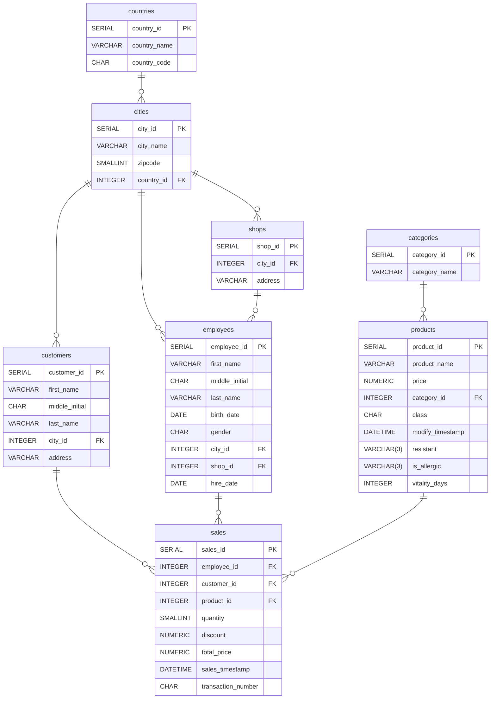

```mermaid
erDiagram
    categories ||--o{ products : ""
    countries ||--o{ cities : ""
    cities ||--o{ employees : ""
    cities ||--o{ customers : ""
    cities ||--o{ shops : ""
    customers ||--o{ sales : ""
    employees ||--o{ sales : ""
    products ||--o{ sales : ""
    shops ||--o{ employees : ""

    categories {
        SERIAL category_id PK
        VARCHAR category_name
    }

    countries {
        SERIAL country_id PK
        VARCHAR country_name
        CHAR country_code
    }

    cities {
        SERIAL city_id PK
        VARCHAR city_name
        SMALLINT zipcode
        INTEGER country_id FK
    }

    customers {
        SERIAL customer_id PK
        VARCHAR first_name
        CHAR middle_initial
        VARCHAR last_name
        INTEGER city_id FK
        VARCHAR address
    }

    employees {
        SERIAL employee_id PK
        VARCHAR first_name
        CHAR middle_initial
        VARCHAR last_name
        DATE birth_date
        CHAR gender
        INTEGER city_id FK
        INTEGER shop_id FK
        DATE hire_date
    }

    shops {
        SERIAL shop_id PK
        INTEGER city_id FK
        VARCHAR address
    }

    products {
        SERIAL product_id PK
        VARCHAR product_name
        NUMERIC price
        INTEGER category_id FK
        CHAR class
        DATETIME modify_timestamp
        VARCHAR(3) resistant
        VARCHAR(3) is_allergic
        INTEGER vitality_days
    }

    sales {
        SERIAL sales_id PK
        INTEGER employee_id FK
        INTEGER customer_id FK
        INTEGER product_id FK
        SMALLINT quantity
        NUMERIC discount
        NUMERIC total_price
        DATETIME sales_timestamp
        CHAR transaction_number
    }
```